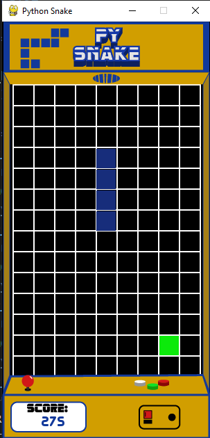

# PySnake
> Classic Snake game made in Python using PyGame

## Table of Contents
* [General Info](#general-information)
* [Technologies Used](#technologies-used)
* [Features](#features)
* [Screenshots](#screenshots)
* [Setup](#setup)
* [Usage](#usage)
* [Project Status](#project-status)
* [Room for Improvement](#room-for-improvement)
* [Contact](#contact)

## General Information
- Passion project carried out back in 2018 as one of my first big programming projects
- PySnake is a Python version of the classic Snake game, complete with retro assets (designed by me) and music (royalty-free)

## Technologies Used
- Python - version 3.9
- Pygame - version 2.0.1 (updated)

## Features
PySnake comes packed with the following features:
- Full GUI version of classic Snake game, with an arcade machine border for the retro feel
- Main Menu, High-Score Board, and working game logic
- Music, Original Assets and More!

## Screenshots

## Setup
In order to play PySnake, you must first install the pygame module through the command line (or otherwise) using `pip install pygame`. After doing this, you should be able to run `main.py` and enjoy the game!

## Usage
Run `main.py` and use the WASD keys to move the snake around

## Project Status
Project is: _complete_

## Room for Improvement

Room for improvement:
- More Game Modes
- Larger Window Size

To do:
- Add More Game Modes

## Contact
Created by [@josflesan](https://www.github.com/josflesan) - feel free to contact me!
